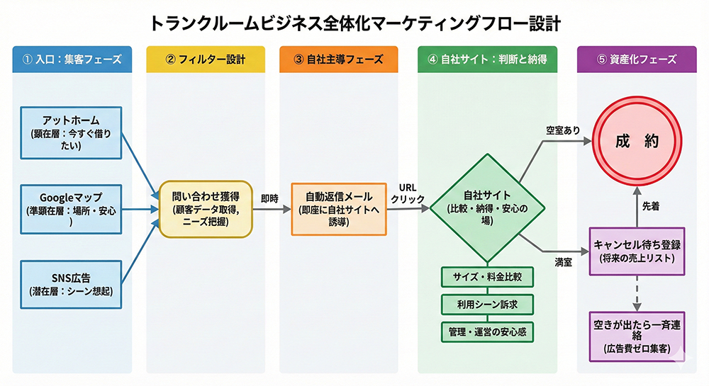

# トランクルーム事業 マーケティング戦略

## 全体の考え方

### マーケティングの主軸

```
集客 → 問い合わせ獲得 → 自社管理下に移行 → 成約／キャンセル待ち資産化
```



### 3つのポイント

1. **最初から売らない**
2. **まず問い合わせを取る**
3. **主導権を自社に戻す**

---

## 1. 入口設計（集客フェーズ）

入口は3系統に分類。

### 1-1. アットホーム（最優先）

| 項目       | 内容                                     |
| ---------- | ---------------------------------------- |
| ターゲット | 顕在層（今すぐ借りたい）                 |
| 特徴       | 検索意図が強い                           |
| 役割       | 存在認知 → 安心感 → 問い合わせ         |
| ゴール     | **問い合わせボタンを押してもらう** |

### 1-2. Googleマップ

| 項目       | 内容                               |
| ---------- | ---------------------------------- |
| ターゲット | 準顕在層（近くで探している）       |
| 特徴       | 倉庫用途が明確でない人も含む       |
| 役割       | 場所と安心感の提示（写真・口コミ） |
| ゴール     | **電話 or 問い合わせ**       |

### 1-3. SNS（広告含む）

| 項目       | 内容                                               |
| ---------- | -------------------------------------------------- |
| ターゲット | 潜在層（今すぐ借りるつもりはない）                 |
| 役割       | トランクルームという選択肢の認知、利用シーンの想起 |
| ゴール     | **問い合わせ**                               |

**訴求する利用シーン例：**

- 引っ越し前後
- 家が片付かない
- 季節家電の保管
- 法人備品

**広告運用方針：**

- 月数千円の小額
- 地域指定
- 利用シーン訴求

---

## 2. 問い合わせ獲得（フィルター設計）

### 共通ゴール

> すべての入口のゴールは「**問い合わせをしてもらう**」こと

### 重要な考え方

**問い合わせ ≠ 成約**

問い合わせは以下の入口として捉える：

- 顧客データ取得
- ニーズ把握
- キャンセル待ち候補

---

## 3. 問い合わせ後（自社主導フェーズ）

問い合わせが入った瞬間に、マーケティングの主戦場は自社に移る。

### 自動返信メールに含める内容

1. 問い合わせのお礼
2. 現在の空き状況
3. 他サイズの案内
4. キャンセル待ちの説明
5. 自社サイトURL

> **ここでアットホーム依存を切る**

---

## 4. 自社サイトの役割設計

### 位置づけ

自社サイトは「**集客サイト**」ではなく「**判断と納得の場**」

### 3つの役割

| 役割                   | 内容                                       | 詳細                                                                            |
| ---------------------- | ------------------------------------------ | ------------------------------------------------------------------------------- |
| **比較できる**   | サイズ比較表、料金一覧、用途別おすすめ     | 問い合わせ後、最短で比較表に行ける導線                                          |
| **ニーズに刺す** | 利用シーンを丁寧に提示                     | 自宅が狭い、片付けが終わらない、法人の一時保管、短期利用 →**自分ごと化** |
| **安心させる**   | 運営者、管理状況、契約単位、解約のしやすさ | **価格より安心を優先**                                                    |

---

## 5. 自社サイト運用の思想

### 基本方針

> 更新が止まると意味がなくなる → **更新のしやすさを最優先**

### 理想像

```
チャットで指示 → ホームページが更新される
```

### 段階的な実現

| 段階    | 内容               | 詳細                                                       |
| ------- | ------------------ | ---------------------------------------------------------- |
| 第1段階 | 手動構築           | HTML/CSSでサイトを構築、空き状況・写真・テキストを手動更新 |
| 第2段階 | AIによるコード変更 | AIがコードを直接編集し、更新作業を自動化                   |
| 第3段階 | チャット連携       | チャットでAIに変更依頼 → コード変更 → 本番反映           |

※後からでも十分追いつける

---

## 6. キャンセル待ち（リスト活用）

### 方針

> **リストを活用して売上を作る**

### 施策

- 問い合わせからの各種案内の自動化
- 空きが出た場合の一斉メール送信の仕組み化

> **広告費ゼロで即成約できる状態を作る**

---

## 7. 全体フローまとめ

```
┌─────────────────────────────────────┐
│          【集客】                    │
│  アットホーム / Googleマップ / SNS広告 │
└─────────────────────────────────────┘
                  ↓
┌─────────────────────────────────────┐
│       【問い合わせ獲得】              │
└─────────────────────────────────────┘
                  ↓
┌─────────────────────────────────────┐
│   【自動返信・自社サイト誘導】         │
└─────────────────────────────────────┘
                  ↓
┌─────────────────────────────────────┐
│      【比較・納得・安心】             │
└─────────────────────────────────────┘
                  ↓
┌─────────────────────────────────────┐
│  【成約 or キャンセル待ち登録】        │
└─────────────────────────────────────┘
```

### この流れで積み上がるもの

- 掲載枠の効率
- 問い合わせの質
- 長期の資産

---

## 8. 業務アクション一覧

### 8-1. アットホーム

| No. | 業務内容 | 目的 |
|-----|----------|------|
| 1 | 掲載画像のブラッシュアップ | 問い合わせボタンを押してもらう |
| 2 | 問い合わせメリットの訴求文作成 | 「問い合わせすれば多数紹介できる」「キャンセル待ち対応可」などを伝える |

### 8-2. Googleマップ

| No. | 業務内容 | 目的 |
|-----|----------|------|
| 3 | 写真の充実 | 安心感を与える |
| 4 | 口コミの充実 | 安心感を与える |
| 5 | ホームページへの誘導強化 | アクセス数を増やす |

### 8-3. SNS広告

| No. | 業務内容 | 目的 |
|-----|----------|------|
| 6 | 広告画像の作成 | 訴求力のあるクリエイティブ準備 |
| 7 | 複数パターンのテスト実施 | 反応の高いシナリオを見つける |
| 8 | 効果的なシナリオを本番ホームページに反映 | 集客効率の最大化 |

### 8-4. 問い合わせ後対応

| No. | 業務内容 | 目的 |
|-----|----------|------|
| 9 | 自動返信メールの仕組み化 | 問い合わせ対応の自動化 |
| 10 | 自動返信メール内容の充実 | 自社サイト誘導・キャンセル待ち案内の強化 |

### 8-5. 自社サイト構築・運用

| No. | 業務内容 | 目的 |
|-----|----------|------|
| 11 | 自社サイトの構築（第1段階） | 判断と納得の場を作る |
| 12 | AIによるコード変更のレクチャー（第2段階） | 更新作業の効率化 |
| 13 | チャットAI連携プログラムの作成（第3段階） | チャット指示でサイト更新を実現 |

### 8-6. リスト活用

| No. | 業務内容 | 目的 |
|-----|----------|------|
| 14 | キャンセル待ち対象者への一斉メール送信の仕組み化 | 広告費ゼロで即成約できる状態を作る |
